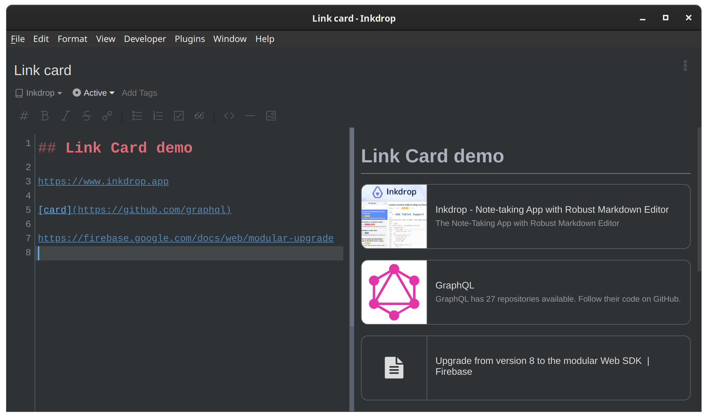
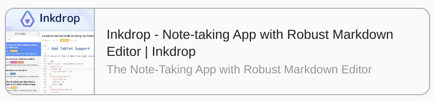

# Link Card


Create link cards from URLs.



## How to use

Write a link with "`card`" caption

```md
[card](https://github.com/elpnt/inkdrop-link-card)
```

Or just write a URL

```md
https://github.com/elpnt/inkdrop-link-card
```

## Settings

- **autolinks**: Create link cards from standard URLs (default: **true**)
- **Cover image shape**: square or wide (default: **wide**)

### Cover image sample

#### Wide


#### Square


