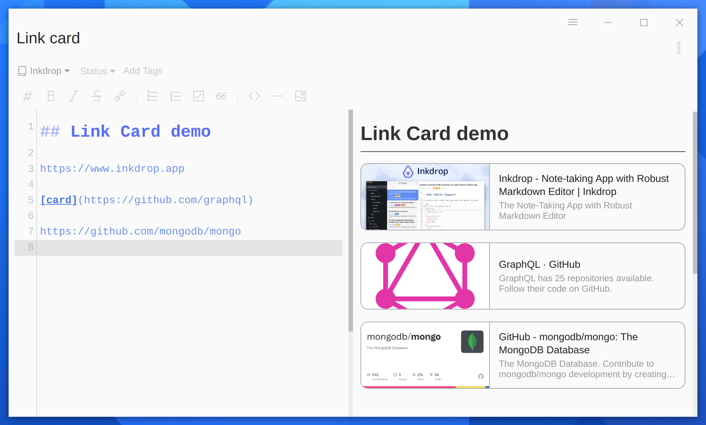

# Link Card


Create link cards from URLs.



## How to use

Write a link with "`card`" caption

```md
[card](https://github.com/elpnt/inkdrop-link-card)
```

Or just write a URL

```md
https://github.com/elpnt/inkdrop-link-card
```

Links without an HTML meta tag having `og:image` property are not converted to cards.

## Settings

- **autolinks**: Creates link cards from standard URLs (default: **true**)
